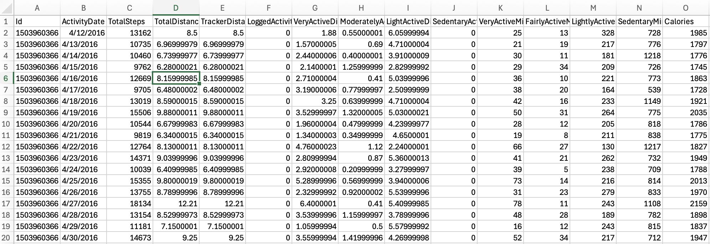

# Bellabeat Casestudy 

This is my Capstone Project for the Google Data Analytics Certificate

## Project Overview

### Table Of Contents
- [The Task](#the-task)
- [Who Is Bellabeat?](who-is-bellabeat?)
- [Data Source](#data-source)
- [Tools](#tools)

#### The Task

Here is the scenario. I am a junior data analyst at Bellabeat, focusing on analyzing fitness data from smart devices. My objective is to focus on on gain insights into user behavior, which will inform and refine the company’s marketing strategy. I’ll present my findings and strategic recommendations to the executive team.

#### Who Is Bellabeat?
#
Bellabeat is a small but successful tech company founded by Urška Sršen and Sando Mur. The main focus of the company is to create beautifully designed wellness based products such as the Leaf, Time and Spring, all devices tailored to women that track health metrics to help improve the quality of life of the user.

#### Data Source

The main data set i will be using for this analysis is the [FitBit Fitness Tracker Data](https://www.kaggle.com/datasets/arashnic/fitbit). This dataset generated by respondents to a distributed survey via Amazon Mechanical Turk between 03.12.2016-05.12.2016.

#### Tools
- Excel
- SQL
- Tableau 

##### Refferences 
[FitBit Fitness Tracker Data](https://www.kaggle.com/datasets/arashnic/fitbit) As stated by Kaggle, this is a highly credible set of data. 

# Analysis

Okay lets take a look at some of the data.

[View Spreadsheet Here](dailyActivity_merged.csv)

